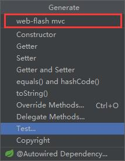
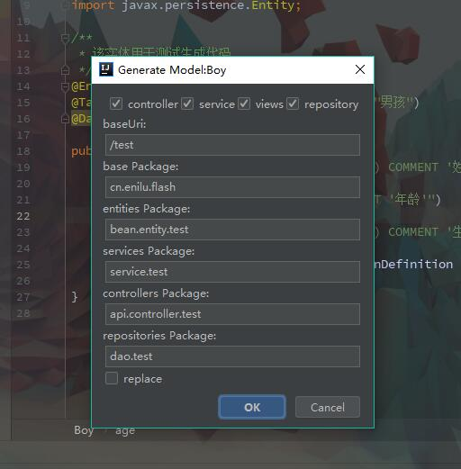

# alistar代码生成工具
 
本项目提供了基于IDEA的插件来生成代码,你可以再idea插件仓库中搜索alistar-generator，或者直接从本地安装插件：alistar-generator/idea-plugin.jar即可
用法如下：

- 写好实体类，例如：
```java
package com.xinshucredit.edu.bean.entity.test;
import com.xinshucredit.edu.bean.entity.BaseEntity;
import lombok.Data;
import org.hibernate.annotations.Table;
import javax.persistence.Column;
import javax.persistence.Entity;

@Data
@Entity(name="t_test_boy")
@Table(appliesTo = "t_test_boy",comment = "男孩")
public class Boy extends BaseEntity {
    @Column(columnDefinition = "INT COMMENT '年龄'")
    private Integer age;
    @Column(columnDefinition = "VARCHAR(32) COMMENT '名称'")
    private String name;

}
``` 
- 上面实体类注意事项
    - @Table注解要使用org.hibernate.annotations.Table 不要使用javax.persistence.Table
    - @Table注解 必须配置表名(applyiesTo)和注释(comment)
    - @Column注解必须配置columnDefinition来表述列信息(英文全部大写)：包括类型,注释COMMENT
    - 实体类必须继承BaseEntity
- 实体类准备好了后,打开实体类，右键选择Generator(或者Alt+Insert)-->alistar-mvc，弹出如下图所示对话框  
 
 
 - 选择alistar mvc，在弹框中勾选生成选项 
 
  
 - 点击生成即可，生成完毕后在vue的router/index.js添加路由，启动api和vue项目，配置上菜单和角色后即可使用
        


以Boy实体为例,执行代码生成后将会生成如下文件：

 

启动alistar-api和flash-vue-admin,配置和菜单和角色权限后就可以访问刚刚生成的代码功能了


        
        
